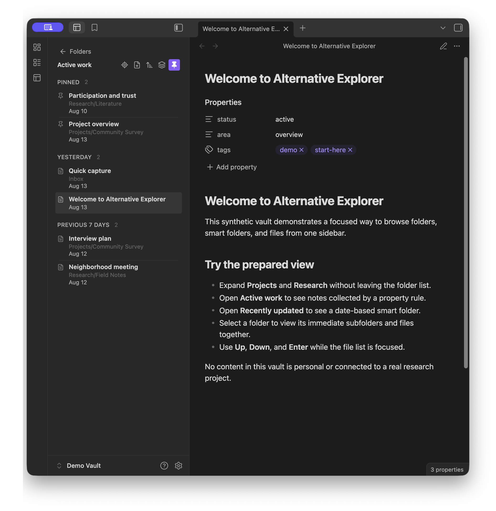
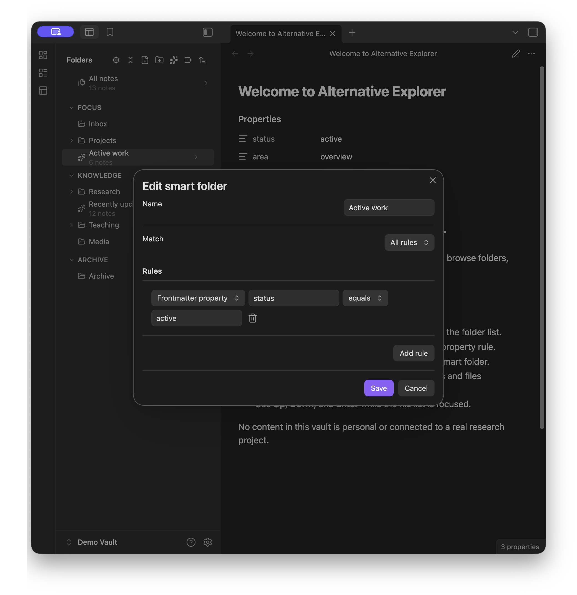

# Alternative Explorer

Alternative Explorer is an Apple Notes–style sidebar for browsing folders and notes in Obsidian. Switch between an expandable folder tree and a notes list — a compact alternative to the built-in File Explorer.

## Folders

- Browse the folder tree, open **All notes** for a vault-wide list, and use **Reveal current note** to jump to the active note's folder.
- Expand or fold the whole tree, including its sections, in one action.
- Group root folders into named, collapsible sections that exist only in this sidebar.
- Drag sections, root folders, and smart folders to change their sidebar order. Drop a folder onto another folder, or back to the vault root, to nest or un-nest it in the vault.
- Sort folders by name, modified time, created time, or a custom order. Set the default in **Settings → Alternative Explorer**, and override it for an individual folder from the explorer.

## Notes

- Open a folder to see its notes, with immediate subfolders listed above. Toggle between this folder only and every note below it.
- Sort notes by name, modified time, or created time. Override the default for a folder, a smart folder, or **All notes**.
- Group notes by modified or created date, with an optional group for pinned notes.
- Move through the notes list with **Up** and **Down**, and press **Enter** to open the selection.
- Create a **New note** or **New folder** from the sidebar: at the vault root from the folder tree, or inside the folder you are viewing.

## Smart folders

- Create saved searches from rules for tags, properties, name, path, created or modified dates, and pinned status.
- Match all or any of the rules, and nest a smart folder under a real folder or a section.

## Install and open

1. In Obsidian, open **Settings → Community plugins**.
2. Search for **Alternative Explorer**, select **Install**, and then select **Enable**.
3. Select the Alternative Explorer ribbon icon or run **Alternative Explorer: Open explorer view** from the command palette.

## Good to know

- Sections, smart folders, sidebar order, and sort overrides are stored in plugin settings. They do not create vault folders.
- Dropping a folder onto another folder, or a nested folder back to the vault root or a section, moves that folder in the vault.
- Pin notes through Obsidian's core Bookmarks plugin. If Bookmarks is disabled, pinned groups are empty and pinning is unavailable.
- Vault files that Obsidian cannot open appear in the notes list. A second click or **Enter** opens them in the system default application when available.
- Alternative Explorer does not search note contents, and it does not rename or delete existing notes.
- Alternative Explorer has been tested only on macOS, iOS, and iPadOS. Other platforms may work but have not been verified.
- The minimum supported Obsidian version is 1.7.2.

## Acknowledgements

Alternative Explorer was inspired by Apple Notes and [Notebook Navigator](https://notebooknavigator.com) ([GitHub](https://github.com/johansan/notebook-navigator)).

## License

Alternative Explorer is released under the [MIT License](LICENSE).
